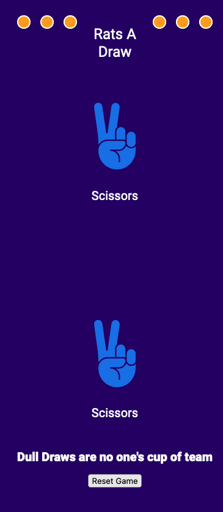

# Rock-Paper-Scissors

My take on the Rock-Paper-Scissors Classic

## Table of contents

- [Overview](#overview)
  - [The challenge](#the-challenge)
  - [Screenshot](#screenshot)
  - [Links](#links)
- [My process](#my-process)
  - [Built with](#built-with)
  - [What I learned](#what-i-learned)
  - [Continued development](#continued-development)

## Overview

This was my take on the classic game Rock-Paper-Scissors. My version includes animation to make the game more interative as well as the option to play one, three or five rounds. It allows you to play against the computer, which generates answers using a simple Math.random algorithm and using the random number as an index to an array of answers.

### Challenges encountered

- Towards the beggining the game kept reseting before rounds, due to me not removing event listeners that started the game. From this I learnt about remove event listeners API.
- This is the most animation I have used in programming so far, so I had to learn how it worked and how to get it to work in the desired sequence I wanted.
- I finally struggled to get game to play Three and Five rounds and finally finish at the respective totals. I overcame this by using callbacks and tracking a round amount in the global scope.

### Screenshot




### Links

- Solution URL: [Repository link](https://github.com/zach7815/rock-Paper-Scissors)
- Live Site URL: [Live Site](https://zach7815.github.io/rock-Paper-Scissors/)

## My process

For this project I planned the various states of how I wanted the game to look at each stage. To do this I used good ole pen and paper to draw the different stages, and annotate what functionality would happen at each stage and some rough ideas of how I would achieve this with code.

Then I decided to work on getting one round to work first and finally implemented three and five rounds after that.

### Built with

- HTML5
- CSS Animations
- Flexbox
- JavaScript

### What I learned

In this project I learnt various things in CSS and in Javascript. For the CSS I learnt how to use CSS animation to add a layer of interactivity to the game.

```Css
.rocCont {
  animation: bounce1 3s ease-in-out infinite;
}
.papCont {
  animation: bounce2 3s ease-in-out infinite;
  animation-delay: 0.2s;
}
.scisCont {
  animation: bounce3 3s ease-in-out infinite;
  animation-delay: 0.4s;
}

@keyframes bounce1 {
  20% {
    transform: translateY(-10%);
  }
  50% {
    transform: translateY(0);
  }
}

@keyframes bounce2 {
  20% {
    transform: translateY(-15%);
  }

  50% {
    transform: translateY(0);
  }
}

@keyframes bounce3 {
  25% {
    transform: translateY(-20%);
  }
  50% {
    transform: translateY(0);
  }
}

```

For the JavaScript I learnt how to detect both a click and any key press with event listeners, as well as how to remove multiple event listeners

```js
// use an array of strings to add multiple event listeners to one HTML element

const interactions = ["click", "keydown"];
interactions.forEach((evt) => body.addEventListener(evt, handler, false));

// remove multiple event listeners
function handler(_e) {
  interactions.forEach((e) => body.removeEventListener(e, handler));
  gameSequence();
}
```

### Continued development

My next steps to teach myself will be to make my first fullstack web application indepedent of tutorials. I plan to utilise Node JS, Express JS and EJS for this as needed.
